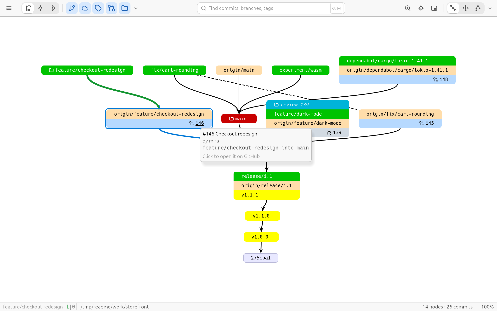
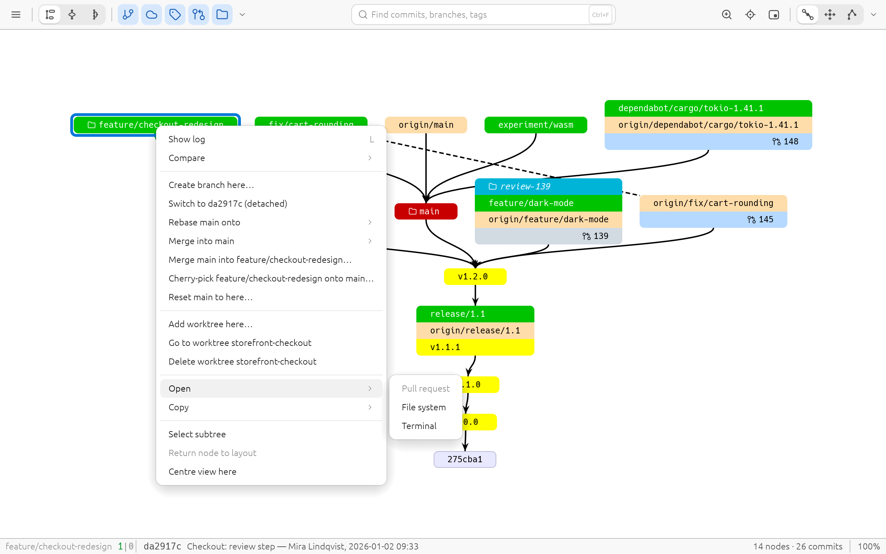
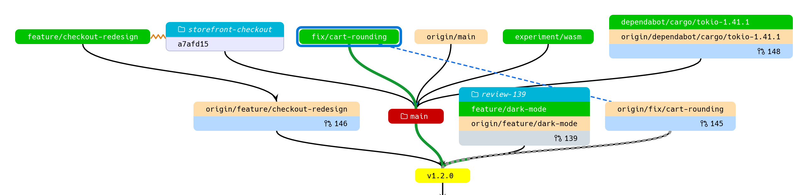
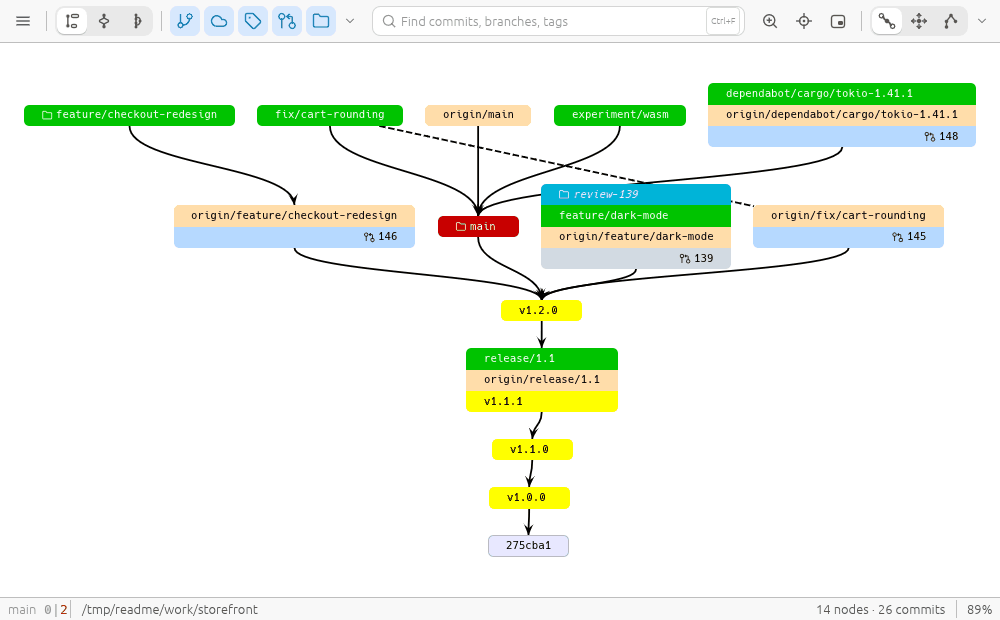
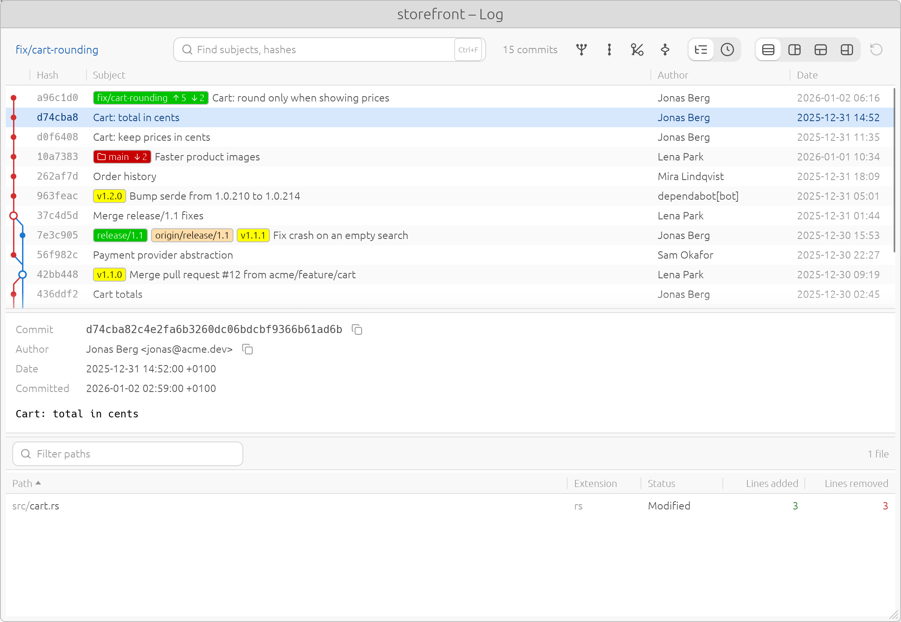
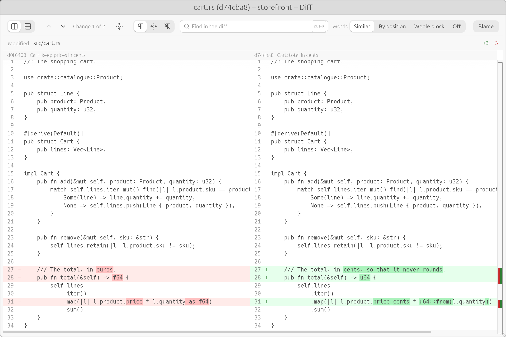
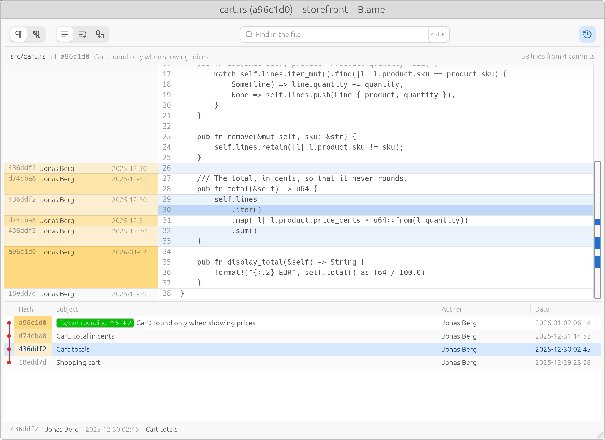

# parterre

[](https://github.com/aquamoth/parterre/releases)
[](https://crates.io/crates/parterre)
[](LICENSE)

**Every branch, worktree and pull request of a git repository in one picture, and the git
operations to act on them.**

parterre is a fast, native revision graph for Linux, Windows and macOS, inspired by
TortoiseGit's *Revision Graph*. It leaves out the commits in between and shows how your branches,
tags, remotes, worktrees and open pull requests relate.

<picture>
  <source media="(prefers-color-scheme: dark)" srcset="docs/images/0.6/hero-dark.png">
  
</picture>

A parterre is a formal garden laid out in patterns, made to be seen from the upper floors of
the house. This one gives you that view of a repository: every branch at once, from above.

## Worktrees, all of them, in one window

Running several agents or tasks at once, each in a worktree of its own? parterre shows every
worktree of the repository in the same graph, with its folder on the commit it has checked out,
in cyan. A detached worktree, such as one for reviewing a pull request, is named by its folder.

- **Go to** a worktree to make it the one parterre works in. The layout and your open windows
  stay, since it is the same history.
- **Add** a worktree at any commit, on a new branch that can track a remote one, and
  **delete** one you are done with.
- **Open** a worktree's folder in your file manager or a terminal, straight from the graph.
- **Merge, rebase, cherry-pick, reset and revert** the open worktree's branch from the graph
  and the log. Each dialog shows what will change and the git command it runs, and can stash
  your uncommitted changes first and put them back after. A rebase lets you pick, squash or
  drop each commit. To merge your branch into `main` as a pull request would, choose
  fast-forward, merge commit, rebase and fast-forward, or semi-linear.
- A worktree stopped in a rebase, merge or cherry-pick shows it in the graph, and a banner
  says what is stopped there and which files conflict.

<picture>
  <source media="(prefers-color-scheme: dark)" srcset="docs/images/0.6/worktrees-dark.png">
  
</picture>

Turn worktrees on with the folder button in the toolbar.

## Pull requests on the commits they propose

When `origin` is on GitHub and the [GitHub CLI](https://cli.github.com) is signed in
(`gh auth login`), parterre labels each open pull request on its branch's commit. Drafts are
greyed out. Hover a label for the title, author and branches, and click it to open the pull
request in your browser. The node's menu opens it too.

parterre asks GitHub only about the branches you have fetched, at most once a minute per
repository, and once more before deleting a remote branch, and keeps well inside your hourly
API budget. Nothing is sent without signing in.
The update check, usage statistics and crash reports are in
[What parterre sends](docs/privacy.md).

## Upstreams, ahead and behind, and rebases

Hover or select a branch, and the commits between it and its upstream light up: green
ahead, blue behind, red where a force push would lose commits, and grey dashed where a rebase
replaced them. The status bar shows `fix/cart-rounding 5|2` (ahead|behind), and the log
`↑5 ↓2`.

A branch that was rebased since it was pushed gets a **dashed arrow to its upstream**. A
worktree in the middle of a rebase gets an **orange zigzag** from where it has got to back to
the branch being rebased.

**Fetch** every remote from the toolbar or with Ctrl+F5, **pull** the open worktree's branch,
and **push** any local branch from its node. A push that would replace the remote's commits
asks first, and says whether the branch has a copy of each; it forces only with a lease
(`--force-with-lease --force-if-includes`). parterre has no password prompt of its own: use a
credential helper or ssh-agent. **Delete** a remote branch from its node: parterre asks
first, lists any commits only it has, and won't delete a branch with an open pull request.

<picture>
  <source media="(prefers-color-scheme: dark)" srcset="docs/images/0.6/rebase-dark.png">
  
</picture>

## Arrange it your way

Drag a node and the graph gives way, as if held by weak magnets: neighbours follow along their
edges and nodes in the way move aside. Edges find new routes through the gaps. You can also
move only the selected nodes, or a whole subtree, undo with `Ctrl+Z`, and press `R` to put
everything back. Turn on *Remember moved nodes* (*Settings → Dragging*) to keep your
arrangement for each repository.

<picture>
  <source media="(prefers-color-scheme: dark)" srcset="docs/images/0.6/drag-dark.gif">
  
</picture>

## History, diffs and blame

Double-click a node for its **log**, or select two for the commits between them. From there,
open a file's **diff**, side by side or unified, with changed words marked and code coloured
by syntax. Or **blame** it, with the history of the file below and each line shaded by age. You can also **compare** any
two commits, or a commit with your working tree.

<table>
  <tr>
    <td width="33%">
      <picture>
        <source media="(prefers-color-scheme: dark)" srcset="docs/images/0.6/log-dark.png">
        
      </picture>
    </td>
    <td width="33%">
      <picture>
        <source media="(prefers-color-scheme: dark)" srcset="docs/images/0.6/diff-dark.png">
        
      </picture>
    </td>
    <td width="33%">
      <picture>
        <source media="(prefers-color-scheme: dark)" srcset="docs/images/0.6/blame-dark.png">
        
      </picture>
    </td>
  </tr>
</table>

## Install

Download parterre for your system from the
[releases page](https://github.com/aquamoth/parterre/releases):

| System | Package | Adds |
|---|---|---|
| Windows | `.msi` | Start menu entry, *Revision Graph* in Explorer's folder menu; no admin rights needed |
| Debian, Ubuntu | `.deb` | menu entry, *Revision Graph* in Nautilus, Dolphin and Nemo |
| Fedora, openSUSE | `.rpm` | the same |
| Linux, macOS, Windows | `.tar.gz` / `.zip` | just the program: put `parterre` on your `PATH` |

```sh
sudo apt install ./parterre_*_amd64.deb      # or: sudo dnf install ./parterre-*.x86_64.rpm
```

With a Rust toolchain:

```sh
cargo binstall parterre            # the release binary, with cargo-binstall
cargo install --locked parterre    # or build it from source
```

parterre runs the `git` you already have, which must be git 2.31 or newer and on your `PATH`.
The `.deb` and `.rpm` install it if needed; on Windows, install
[Git for Windows](https://git-scm.com/download/win) first. The Linux build needs glibc 2.35 or
newer (Debian 12, Ubuntu 22.04 and later).

## Quick start

```sh
cd ~/src/my-project
parterre                           # the repository you are in
parterre ~/src/other --worktrees   # another one, with its worktrees shown
```

| Do | To |
|---|---|
| Double-click a node, or `L` | Show its log |
| Right-click a node | Compare, branch, merge, rebase, worktrees, open, copy |
| Drag a node; `1` `2` `3` | Move it; the graph gives way / only the selection / the whole subtree |
| `F`, `Home` | Fit the whole graph, go to HEAD |
| `Ctrl+F` | Find branches, tags, hashes, subjects or authors |
| `F5` | Reload (parterre also reloads by itself when refs change) |
| `Ctrl+,` | Settings |

A few command-line options:

```sh
parterre --mode forks              # also show where labelled histories fork apart
parterre --hide 'pipeline/*'       # leave out build branches
parterre --branch-color 'feature/*=#9b59b6'   # colour branches by name
parterre --export graph.svg        # write the graph as SVG (or .png, .webp), no window
parterre --help                    # all of them
```

The rest is in the [user guide](docs/usage.md): every key and mouse action, the views and
filters, the log, diff, blame and compare windows, and settings you can share with your team.

## More

- [docs/usage.md](docs/usage.md): the user guide.
- [docs/automation.md](docs/automation.md): drive parterre from scripts, for screenshots,
  recordings and checks without a human. All the images above were made that way.
- [docs/privacy.md](docs/privacy.md): what parterre sends, where it goes and how to turn it
  off.
- [docs/building.md](docs/building.md): build it yourself (`cargo build --release`).
- [docs/architecture.md](docs/architecture.md): how it works. `crates/parterre-core` holds
  the git loading, graph reduction, layout and physics, free of any GUI; `parterre-forge` the
  pull requests, `parterre-highlight` the syntax colour and `parterre-telemetry` the update
  check and usage statistics, each with its own dependencies; `parterre-util` what they share;
  `crates/parterre` is the egui window.
- [docs/research/](docs/research/): how TortoiseGit's revision graph works, with source links.

Ideas, questions and bugs are welcome in [GitHub issues](https://github.com/aquamoth/parterre/issues).
Read [CONTRIBUTING.md](CONTRIBUTING.md) before writing code for a pull request.

## License

parterre is free software under the [GNU General Public License, version 3](LICENSE) only, with
two additional terms in [NOTICE](NOTICE): works based on parterre keep its copyright notice and
say that they are based on it, and modified versions are marked as modified. You may use, share
and modify parterre at home and at work.
